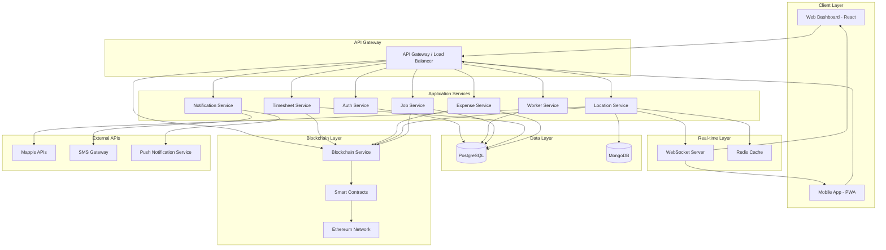
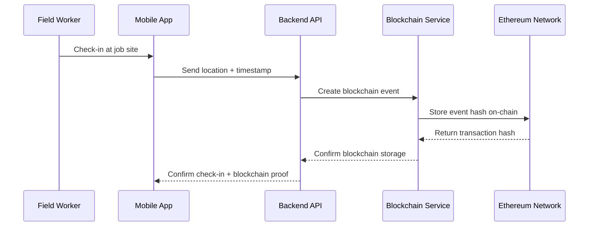

# WorkForce Navigator - Design Document

## Overview

WorkForce Navigator is a web-based platform built with a modern microservices architecture that integrates with Mappls APIs to provide comprehensive field workforce management. The system consists of a React-based web dashboard for managers, a Progressive Web App (PWA) for field workers, and a Node.js backend with real-time capabilities.

### Key Design Principles

- **Real-time First**: All location and status updates propagate instantly across the system
- **Mobile-Optimized**: Field worker interface designed for mobile devices with offline capabilities
- **Scalable Architecture**: Microservices design to handle growing workforce and feature expansion
- **API-Driven**: RESTful APIs with WebSocket support for real-time updates
- **Security-Focused**: Role-based access control and secure location data handling

## Architecture

### System Architecture Diagram



### Technology Stack

**Frontend:**

- **Web Dashboard**: React 18 with TypeScript, Material-UI, React Query for state management
- **Mobile App**: Progressive Web App (PWA) with React, service workers for offline support
- **Maps Integration**: Mappls Web SDK for interactive mapping
- **Blockchain Integration**: Web3.js for Ethereum interaction, MetaMask integration

**Backend:**

- **Runtime**: Node.js with Express.js framework
- **Language**: TypeScript for type safety
- **Real-time**: Socket.io for WebSocket connections
- **Authentication**: JWT tokens with refresh token rotation
- **Blockchain**: Ethers.js for Ethereum smart contract interaction

**Databases:**

- **Primary Database**: PostgreSQL for transactional data (users, jobs, timesheets, expenses)
- **Location Database**: MongoDB for high-frequency location data and geospatial queries
- **Cache**: Redis for session management and real-time data caching
- **Blockchain**: Ethereum network for immutable audit logs and critical event storage

**External Integrations:**

- **Mappls APIs**: Maps, Routing, Geofencing, Places
- **Notifications**: Firebase Cloud Messaging (FCM) for push notifications
- **SMS**: Twilio or similar SMS gateway
- **Blockchain Network**: Ethereum mainnet/testnet or Polygon for cost efficiency

## Components and Interfaces

### Core Services

#### 1. Authentication Service

**Responsibilities:**

- User authentication and authorization
- Role-based access control (Manager, Field Worker, Admin)
- JWT token management

**Key Interfaces:**

```typescript
interface AuthService {
  login(credentials: LoginCredentials): Promise<AuthResponse>;
  refreshToken(token: string): Promise<AuthResponse>;
  validateToken(token: string): Promise<UserContext>;
  logout(userId: string): Promise<void>;
}

interface UserContext {
  userId: string;
  role: 'manager' | 'field_worker' | 'admin';
  permissions: string[];
  organizationId: string;
}
```

#### 2. Worker Service

**Responsibilities:**

- Worker profile management
- Availability status tracking
- Skill and certification management

**Key Interfaces:**

```typescript
interface WorkerService {
  getWorkers(filters: WorkerFilters): Promise<Worker[]>;
  updateWorkerStatus(workerId: string, status: WorkerStatus): Promise<void>;
  getWorkersByProximity(
    location: Coordinates,
    radius: number
  ): Promise<Worker[]>;
}

interface Worker {
  id: string;
  name: string;
  email: string;
  phone: string;
  status: 'available' | 'busy' | 'offline';
  currentLocation?: Coordinates;
  skills: string[];
  teamId: string;
}
```

#### 3. Location Service

**Responsibilities:**

- Real-time location tracking
- Geofence management
- Location history storage

**Key Interfaces:**

```typescript
interface LocationService {
  updateLocation(workerId: string, location: LocationUpdate): Promise<void>;
  createGeofence(geofence: GeofenceDefinition): Promise<string>;
  checkGeofenceEvents(
    workerId: string,
    location: Coordinates
  ): Promise<GeofenceEvent[]>;
  getLocationHistory(
    workerId: string,
    timeRange: TimeRange
  ): Promise<LocationPoint[]>;
}

interface GeofenceDefinition {
  id: string;
  name: string;
  center: Coordinates;
  radius: number;
  jobSiteId: string;
}

interface GeofenceEvent {
  type: 'enter' | 'exit';
  geofenceId: string;
  timestamp: Date;
  location: Coordinates;
}
```

#### 4. Job Service

**Responsibilities:**

- Job creation and assignment
- Job status tracking
- Assignment optimization

**Key Interfaces:**

```typescript
interface JobService {
  createJob(job: CreateJobRequest): Promise<Job>;
  assignJob(jobId: string, workerId: string): Promise<void>;
  getOptimalWorkers(jobLocation: Coordinates): Promise<WorkerDistance[]>;
  updateJobStatus(jobId: string, status: JobStatus): Promise<void>;
}

interface Job {
  id: string;
  title: string;
  description: string;
  location: Coordinates;
  assignedWorkerId?: string;
  status: 'pending' | 'assigned' | 'in_progress' | 'completed';
  priority: 'low' | 'medium' | 'high' | 'urgent';
  estimatedDuration: number;
  createdAt: Date;
  scheduledFor?: Date;
}
```

#### 5. Route Optimization Service

**Responsibilities:**

- Route calculation using Mappls APIs
- Multi-stop optimization
- Real-time traffic integration

**Key Interfaces:**

```typescript
interface RouteService {
  calculateOptimalRoute(
    start: Coordinates,
    destinations: Coordinates[]
  ): Promise<OptimizedRoute>;
  getTrafficAwareRoute(start: Coordinates, end: Coordinates): Promise<Route>;
  recalculateRoute(
    routeId: string,
    currentLocation: Coordinates
  ): Promise<Route>;
}

interface OptimizedRoute {
  totalDistance: number;
  totalDuration: number;
  waypoints: RouteWaypoint[];
  estimatedSavings: number;
}
```

#### 6. Blockchain Service

**Responsibilities:**

- Immutable audit log storage on Ethereum
- Smart contract interaction for critical events
- Blockchain-based verification and transparency

**Key Interfaces:**

```typescript
interface BlockchainService {
  logTimesheetEvent(event: TimesheetBlockchainEvent): Promise<string>;
  logLocationEvent(event: LocationBlockchainEvent): Promise<string>;
  logExpenseEvent(event: ExpenseBlockchainEvent): Promise<string>;
  verifyEventIntegrity(transactionHash: string): Promise<boolean>;
  getEventHistory(
    workerId: string,
    eventType: string
  ): Promise<BlockchainEvent[]>;
}

interface BlockchainEvent {
  transactionHash: string;
  blockNumber: number;
  timestamp: Date;
  eventType: 'timesheet' | 'location' | 'expense' | 'job_assignment';
  workerId: string;
  dataHash: string;
  gasUsed: number;
}

interface TimesheetBlockchainEvent {
  workerId: string;
  jobSiteId: string;
  eventType: 'check_in' | 'check_out';
  timestamp: Date;
  location: Coordinates;
  dataHash: string;
}
```

### Data Models

#### Core Entities

```typescript
// User and Worker Models
interface User {
  id: string;
  email: string;
  passwordHash: string;
  role: UserRole;
  organizationId: string;
  createdAt: Date;
  lastLoginAt?: Date;
}

interface WorkerProfile extends User {
  firstName: string;
  lastName: string;
  phone: string;
  employeeId: string;
  teamId: string;
  skills: Skill[];
  currentStatus: WorkerStatus;
  homeBase?: Coordinates;
}

// Location Models
interface LocationPoint {
  workerId: string;
  coordinates: Coordinates;
  timestamp: Date;
  accuracy: number;
  source: 'gps' | 'network' | 'manual';
}

interface Coordinates {
  latitude: number;
  longitude: number;
}

// Job and Assignment Models
interface JobSite {
  id: string;
  name: string;
  address: string;
  coordinates: Coordinates;
  geofence: GeofenceDefinition;
  organizationId: string;
}

interface JobAssignment {
  id: string;
  jobId: string;
  workerId: string;
  assignedAt: Date;
  startedAt?: Date;
  completedAt?: Date;
  status: AssignmentStatus;
}

// Timesheet Models
interface TimesheetEntry {
  id: string;
  workerId: string;
  jobSiteId: string;
  checkInTime: Date;
  checkOutTime?: Date;
  checkInLocation: Coordinates;
  checkOutLocation?: Coordinates;
  totalHours?: number;
  status: 'active' | 'completed' | 'flagged';
}

// Expense Models
interface ExpenseEntry {
  id: string;
  workerId: string;
  date: Date;
  type: 'mileage' | 'meal' | 'accommodation' | 'other';
  amount: number;
  description: string;
  routeData?: RouteData;
  status: 'pending' | 'approved' | 'rejected';
  blockchainHash?: string;
}

// Blockchain Models
interface SmartContractEvent {
  contractAddress: string;
  eventName: string;
  transactionHash: string;
  blockNumber: number;
  timestamp: Date;
  args: any;
}

interface AuditLog {
  id: string;
  entityType: 'timesheet' | 'expense' | 'location' | 'job';
  entityId: string;
  action: 'create' | 'update' | 'delete';
  userId: string;
  timestamp: Date;
  dataHash: string;
  blockchainHash?: string;
  verified: boolean;
}
```

## Error Handling

### Error Categories and Responses

1. **Location Service Errors**
   - GPS unavailable: Fallback to network location
   - Geofence calculation errors: Log and retry with default radius
   - Mappls API failures: Use cached data and queue requests for retry

2. **Real-time Communication Errors**
   - WebSocket disconnection: Automatic reconnection with exponential backoff
   - Message delivery failures: Store in queue and retry
   - Network connectivity issues: Offline mode with local storage

3. **Data Consistency Errors**
   - Concurrent job assignments: Implement optimistic locking
   - Location data conflicts: Use timestamp-based resolution
   - Timesheet discrepancies: Flag for manual review

### Error Response Format

```typescript
interface ErrorResponse {
  error: {
    code: string;
    message: string;
    details?: any;
    timestamp: Date;
    requestId: string;
  };
}

// Standard error codes
enum ErrorCodes {
  LOCATION_UNAVAILABLE = 'LOCATION_001',
  GEOFENCE_VIOLATION = 'LOCATION_002',
  JOB_ASSIGNMENT_CONFLICT = 'JOB_001',
  WORKER_UNAVAILABLE = 'WORKER_001',
  ROUTE_CALCULATION_FAILED = 'ROUTE_001',
  AUTHENTICATION_FAILED = 'AUTH_001',
  INSUFFICIENT_PERMISSIONS = 'AUTH_002',
}
```

## Testing Strategy

### Testing Pyramid

1. **Unit Tests (70%)**
   - Service layer business logic
   - Data model validation
   - Utility functions
   - API endpoint handlers

2. **Integration Tests (20%)**
   - Database operations
   - External API integrations (Mappls, SMS, Push notifications)
   - Service-to-service communication
   - WebSocket connections

3. **End-to-End Tests (10%)**
   - Critical user workflows
   - Cross-platform compatibility
   - Real-time features
   - Geofencing accuracy

### Testing Tools and Frameworks

- **Unit Testing**: Jest with TypeScript support
- **Integration Testing**: Supertest for API testing, MongoDB Memory Server
- **E2E Testing**: Playwright for web dashboard, Cypress for mobile PWA
- **Load Testing**: Artillery.js for API performance
- **Location Testing**: Mock GPS coordinates and geofence scenarios

### Key Test Scenarios

1. **Location Tracking**
   - Accurate location updates under various network conditions
   - Geofence entry/exit detection with different movement patterns
   - Battery optimization and background location tracking

2. **Real-time Features**
   - WebSocket connection stability under load
   - Message delivery guarantees
   - Concurrent user scenarios

3. **Route Optimization**
   - Multi-stop route efficiency
   - Traffic condition handling
   - Fallback scenarios when Mappls API is unavailable

4. **Data Integrity**
   - Timesheet accuracy with various check-in/out patterns
   - Expense calculation correctness
   - Concurrent job assignment handling

### Blockchain Integration Strategy

#### Smart Contract Architecture

**WorkforceAuditContract.sol**

- Stores critical workforce events with immutable timestamps
- Implements access control for authorized system interactions
- Provides event verification and integrity checking
- Optimized for gas efficiency with batch operations

**Key Smart Contract Functions:**

```solidity
contract WorkforceAuditContract {
    struct WorkforceEvent {
        string workerId;
        string eventType;
        uint256 timestamp;
        bytes32 dataHash;
        string metadata;
    }

    function logEvent(WorkforceEvent memory event) external onlyAuthorized returns (bytes32);
    function verifyEvent(bytes32 eventHash) external view returns (bool);
    function getWorkerEvents(string memory workerId) external view returns (WorkforceEvent[] memory);
}
```

#### Blockchain Integration Points

1. **Timesheet Events**: Check-in/out events stored with location proof
2. **Expense Claims**: Mileage and expense data with route verification
3. **Job Assignments**: Critical job assignments and completions
4. **Location Milestones**: Key location events for audit trails
5. **System Changes**: Administrative changes and configuration updates

#### Gas Optimization Strategies

- **Batch Operations**: Group multiple events into single transactions
- **Data Compression**: Store only essential data on-chain, full data off-chain
- **Layer 2 Solutions**: Use Polygon or similar for cost-effective transactions
- **Event Filtering**: Only store high-value events requiring immutability

#### Blockchain Data Flow



### Performance Requirements

- **Location Updates**: Process 1000+ concurrent location updates per second
- **API Response Time**: 95% of requests under 200ms (excluding blockchain operations)
- **Real-time Latency**: WebSocket messages delivered within 100ms
- **Mobile Performance**: App startup under 3 seconds, smooth 60fps animations
- **Offline Capability**: 8 hours of offline operation with data sync on reconnection
- **Blockchain Performance**:
  - Event logging within 30 seconds during normal network conditions
  - Batch processing for cost optimization (max 50 events per transaction)
  - Fallback to traditional logging if blockchain is unavailable
